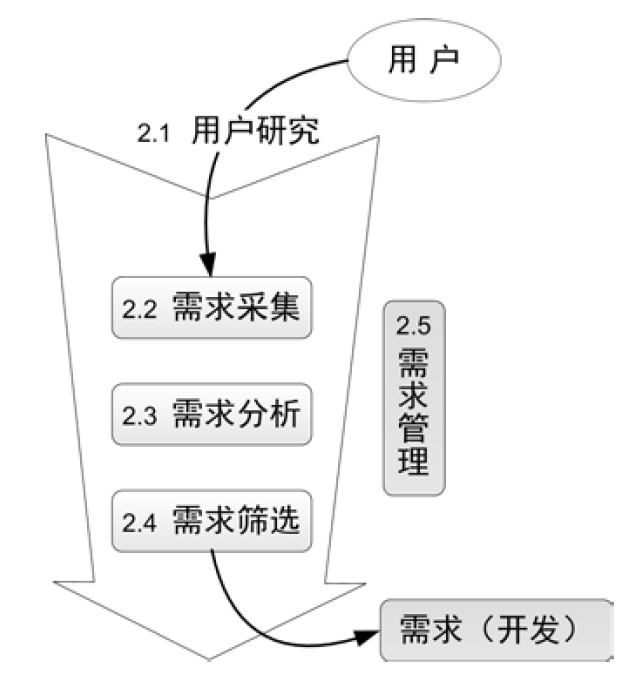

# 需求

资源总是有限的，需求可能会有很多，所以才需要选出来性价比最高的需求. 

### 用户研究

一、马斯洛需求层次理论:

1. 生理需求
2. 安全需求
3. 社交需求
4. 尊重需求
5. 自我实现需求

二、用户与客户

> 试图满足所有用户的需求是一个灾难，这会让产品变成一个臃肿不堪，谁都不满意的四不像，所有对用户的需求会有优先级评估，这类评估往往需要和商业目标结合起来考虑。
> 

用户是user，是使用产品的人；客户是customer，是为产品付钱的人。用户和客户往往广义上都称为用户，只是重要性上有侧重，评估需求时也往往更偏向于客户。

三、用户研究方法

- 听用户定性的说来确定产品方向，做什么
- 听用户定量的说来确定需求优先级，先做什么
- 看用户定性的做来确定要先做哪几个需求，应该怎么做
- 看用户定量的做，比如根据产品的用户使用情况做数据分析，不断改进产品

### 需求采集

明确目标、选择采集方法、制定采集计划、执行采集、资料整理，然后进入下一步的需求分析阶段

具体的用户需求采集方法:

- 用户访谈
    - 避免一组固定的问题：固定的问题会让被访者产生被审问的感觉，我们应该准备好问题清单，但清单只起一个引导作用，并不用照着读。
    - 首先关注目标，任务其次：比用户行为更重要的是行为背后的原因，多问问用户为什么这么做。
    - 避免让用户成为设计师：听用户说，但不要照着做，用户的解决方案通常短浅、片面。
    - 避免讨论技术：特别是碰到一些略懂技术的用户，不要与其纠缠产品的实现方式。
    - 鼓励讲故事：故事是最好的帮助设计师理解用户的方法。
    - 避免诱导性的问题：典型的诱导问题是“如果有××功能，你会使用么？”一般来说用户会给出毫无意义的肯定答复。
- 调查问卷
    - 优点
        - 调查问卷一人一份，独立作答，可消除“焦点小组”、“论坛发贴征集需求”等具有群体讨论性质的方法的弊端。这是因为**用户有其特点——沉默与骑墙的总是大多数：**
        - 《长尾理论》里说到“沉默的大多数”，那么站出来的总是很少数，而且往往是非典型的用户，不能保证其代表了目标用户的想法；而“骑墙的大多数”说的是，大多数人是没有明确观点的，尤其在网络这样一个不用负责任的环境下，所以常见的情况就是开始表态的那几个人的观点引导了群体的观点，随机的初始值决定了结果，这个时候你只有单独和跟风者交流，才会发现他根本不是那么想的
    - 缺点
        - 样本的偏差，即样本与想了解的目标用户群体出现偏差
        - 样本过少的问题
        - 问卷内容的细节问题
- 可用性测试
    - 测试时间，一定要进行测试
    - 明确是测试产品，而不是测试用户
    - 做测试的过程中千万不要有任何的引导与暗示，而只是观察和记录，因为任何引导都可能使得原本可以发现的问题无法暴露。用户行为和预想的不一样时，可以提问，实在进行不下去的时候，给予提示。
- 数据分析
    - 我们要意识到，用户“怎么说”和“怎么做”不同，甚至经常有矛盾，有时候用户的行为比语言更能反映出他的真实需求

单项需求卡片示例:

### 需求分析

**用户需求VS.产品需求**

- 用户需求：用户自以为的需求，并且经常表达为用户的解决方案。
- 产品需求：经过我们的分析，找到的真实需求，并且表达为产品的解决方案。
- 需求分析：从用户提出的需求出发，找到用户内心真正的渴望，再转化为产品需求的过程。

**满足需求的三种方式**

需求来源于理想与现实的差距，那么减小这个差距就有三种方式：

- 改变现状。是我们最常用的，去开发某种产品，但也是最笨的办法。
- 降低理想。不要忽视精神的力量，什么“打预防针”、“丑话说在前头”这类句子想必大家都经常听到。
- 转移需求。因为人类的注意力是有限的，所以引导用户去关注其他事物，他就会觉得这个差距没那么可憎了。我们也可以说，人的行为是需求驱动的，想改变人的行为，可以寻找更强烈的需求展现给他，而让他不再纠结于原来的需求。

**需求分析流程**

1.把用户需求转化为产品需求

2.确定基本属性

- 分类：新增功能、功能改进、体验提升、Bug 修复、内部需求等
- 层次：基础、扩展（期望需求）、增值（兴奋需求）

3.商业价值

- 重要性：满足后“一般”到“非常高兴”；未实现“略感遗憾”到“非常懊恼”。更多可以参考KANO 模型。
- 紧急度：
- 持续时间：

商业价值，或者叫商业优先级，是对上述几种商业价值指标的综合评判。这一条是整个需求列表中最核心的部分，这里的判断直接影响着产品未来的方向。有时候我们还在列表里增加一列“商业价值描述”，通俗点就是这个需求的卖点是什么，可以给用户提供什么价值，对公司又有什么帮助。

### 需求筛选

- 需求打包
    - 将可用的工作量对应到预计的工作量中。个人理解就是将工作量化和细化的过程。
- BRD制作
    - BRD： business requirement document,商业需求文档，包括项目背景、商业价值、功能需求描述、非功能需求描述、资源评估、风险和对策等内容。
    - MRD： Market Requirement Document, 市场需求文档
    - PRD： Product. Requirement Document, 产品需求文档
- 产品会议
    - 通过产品会议来讨论产品需求、商业价值等。

BRD制作例子:

- **项目背景**：我们在哪里？为什么要做这个项目，解决什么问题，可以列出一些数据说明项目的必要性。
- **商业价值**：我们去哪里？最关键的重点！大老板们最感兴趣的，做了这个项目以后有什么价值，一定要说在点子上。一般我们还会预测一下相关**数字的变化**，提出这个项目的**商业目标**。
- **功能需求描述**：我们怎么去？通过做哪些事情来达到目标，把打好包的需求描述一下，可以用功能列表的形式表达，但最好能画出业务逻辑关系。当然我们也经常会搞点技巧性的东西，比如故意加入一些让老板砍的需求，希望老板砍完之后心有愧疚不好意思再砍我们真正想做的东西，这有点类似谈判技巧里的玩意，大家可以试试，但不要在这上面太花心思了。
- **非功能需求描述**：提一下重要的非功能需求，如果有的话。
- **资源评估**：第二个重点！大老板们要看成本，他们在了解达成项目的目标需要多大的花费以后，才能做出决策。
- **风险和对策**：有的项目会有一些潜在风险，这个时候不妨抛给老板们看一下，并且给出自己的对策，说不定你觉得是很大的麻烦，在老板那里一句话就可以搞定。而且由于信息的不对称，我们无法了解某些功能是否会与公司将来的战略冲突，这时候提出来也是让老板们把一下关。

### 需求管理

随着需求越来越多，随之而来的就是我们需要在资源限制下找到最有价值的需求，然后把它做好。产生的新问题就是我们需要有个办法把越来越多的需求管理起来。

一、完整的需求属性:

| 需求属性 | 属性说明 |
| --- | --- |
| 编号 | 需求的顺序号，唯一表示 |
| 提交人(*) | 需求的录入PD，负责解释需求 |
| 提交时间 | 需求的录入时间，辅助信息 |
| |模块(*) | 根据产品的模块划分(一般**5±25±2**)个模块 |
| 名称(*) | 用简洁的短语描述需求 |
| 描述(*) | 需求描述：无歧义、完整性、一致性、可测试性等 |
| 提出者 | 即需求的原始提出者，有疑惑时便于追溯 |
| 提出时间 | 原始需求的获得时间，辅助信息 |
| bug编号 | 将一些bug视为需求，统一管理 |
| 分类 | 新增功能、功能改进、体验提升、bug修复、内部需求等 |
| 层次 | 基础、扩展（期望需求）、增值（兴奋需求）（参见KANO模型） |
| 重要性 | 重要程度，辅助信息 |
| 紧急度 | 紧急程度，辅助信息 |
| 持续时间 | 持续时间，辅助信息 |
| 商业价值(*) | 行业优先级，不考虑实现难度，群体决策 |
| 开发量(*) | 需求的开发工作量，表征实现难度，如以“人天”为单位 |
| 性价比(*) | 商业价值/开发量，用于决定先做哪个 |
| 状态(*) | 需求生命周期：待讨论、暂缓、拒绝、需求中、开发中、已发布 |
| 负责PD(*) | 状态进入“需求中”后确定 |
| 开发工程师 | 状态进入“开发中”后确定 |
| 项目名称 | 需求的发布项目 |
| 发布时间 | 需求的发布时间 |
| 备注 | 其他任何信息，如：1.被拒绝的理由 2.被暂缓的理由和重启条件 3.相关文档 |

二、需求的周期

三、需求管理详细图

