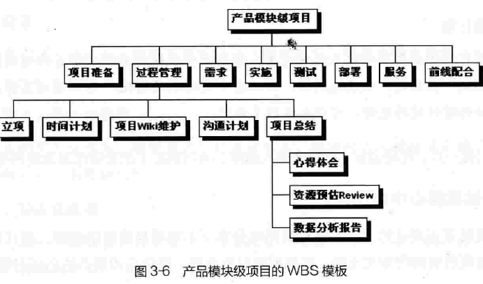

# 项目

## 从产品到项目

项目的定义：只会进行一次，包含多项互相关联的任务，并且有绩效、时间、成本和范围限制的一项工作。

- 产品经理：靠想。产品经理是做正确的事，其所领导的产品是否符合市场的需求，是否能给公司带来利润。对产品经理来说，重要的是判断力与创造力。
- 项目经理：靠做。项目经理是把事情做正确，把事情做得完美，在时价、成本和资源约束的条件下完成目标。对项目经理来说，重要的是执行力与控制力。

## kick off

项目启动会，需要明确传达如下信息:

1. 项目背景。我们在哪儿，为什么做这个项目。
2. 项目意义、目的和目标。我们去哪里？解决什么问题就算成功了。
3. 需求、功能点概述。我们怎么去？具体使用什么方法？
4. 项目组织架构。让项目成员互相认识，明确有什么事应该找谁。
5. 项目计划。项目的时间点和里程碑，各个时段需要的资源。
6. 沟通计划。约定好怎么沟通。

对一个全新的项目，我们该如何入手呢？在了解背景、目的、目标等前提下，明确任务之后，首先是分解任务。 以下是示例的WBS(工作分解结构)模版：

## 需求回顾

在需求阶段我们经历采集、分析、筛选、立项最终到了要实现的阶段了，这个阶段往往开发、测试、运维等负责具体实施的同学都是头一次开始接触这个需求，所以有必要再次回顾一下需求，确保做的人真正弄清楚了。

### 用例说明

在澄清需求文档后，接下来重要的便是对需求中的所有用例进行说明了，包括并不限于类图、用例图、状态图等表示方法, 即我们常说的UML。

- 类图
    - 描述各个对象之间的关系以及和外部系统的关系，比如是组合、继承、还是关联的关系，是对业务领域的描述。常用于表达实体间的属性关系。
- 用例图
    - 描述各个用例之间的关系，即用例和行为者(actor)之间的关系，常用于表达实体间的事件行为。
- 状态图
    - 描述系统里实体的状态转换，同样是贯穿多个用例之间的。和用例图的不同点是，重点描述事件在不同状态下的的行为模式。

具体的用例文档示范:

续-

**时序图、活动图及其他**

- **时序图：Sequence Diagram，也叫顺序图，描述事物变化在时间维度上的先后顺序，善于表达对象的交互，比如多个页面之间、多个角色之间。**
- **Activity Diagram，比较接近我们常说的流程图，描述各种动作如何引起系统变化，善于表达泳道较多、分支较多的情况。**

**上面的用例文档结合UML图(从各个视角描述同一件事)，最终都是为了把需要做的需求给别人说清楚！所以重点在于说清楚，具体形式完全由团队自己的风格来决定**

### 产品原型

产品demo, 给最终产品先打一个草稿，形式主要表现交互和视觉细节，一般会经历低保真到高保真的过程。产品原型对UI、前端同学尤为重要。

### 评审

- 技术评审
    - 开发人员在理解清楚需求后，需要就自己的实现先出一份概要设计于详细设计，然后团队成员再一起评审，一是为了确保实现方向和方法不会出现偏差，二也是为了开发人员自身保证自己的思路清晰。
- 测试评审
    - 测试人员在具体动工之前也需要输出TC(测试用例)，并且通过评审说给产品经理、开发人员听，评审的目的与技术评审是差不多的

**再次总结需求的生命周期:**

## 研发阶段

该阶段开发、测试等人员都进入了具体实施阶段，产品经理要做的就是配合确认需求，项目经理要做的就是控制。

控制手段包括:

- 需求用例、产品原型对称同步
- 技术设计评审、测试用例评审
- 晨会快速对称进度和问题、任务管理
- 测试bug验收、产品验收测试(UAT)
- 功能评审(测试后再演示一轮，确保做出来的东西就是大家想要的)
- 项目发布:  确认验收、确认发布时间和节奏以及影响点、发布公告
- 项目小结:  平时通过项目日报或周报记录情况，总结时再归纳思考
- 拥抱变化: 过程中往往会出现一些变更事件、紧急事件，要做好协调和沟通工作，上层管理和团队内成员管理都要兼顾到

## 项目管理

计划与控制，就是项目管理.

### 文档积累

文档只是手段，重要的是要把过程记录清楚，在后期总结和反思时都会非常有用。

### 流程

当年的“英雄”把自己的个人经验转变成显性知识表达出来，而**对于经常做的事情，就可以用流程这种形式固化、传承，后人在做这些事的时候起码不会太无助。在这点上，规范、模板的作用也类似，这就是团队的核心竞争力。**

**一件事情总是有它的两面，流程帮助了产品，但对于后来者的个人成长也许不利，**比如只能接触到产品工作的某一个层面，缺乏对大局的了解和把握，从而成为一颗“螺丝钉”。这就需要后来者自己寻求突破了。

- **产品会议：必须有，决定“做不做、做多少”实在太重要了，方向错了很可怕。**
- **Kick Off会议：**最好开一下，鼓舞士气的，磨刀不误砍柴工，可以考虑与需求评审合并为一次会议，安排在最开始的15分钟，因为它们参加的人员差不多。
- **需求评审：如果项目Kick Off之后只做一次评审的话，那就是需求评审。具体的PRD、UC、Demo评审，我们也很少分为三次，**看项目情况。举些例子，如果某个项目没产生几个新页面的话，Demo评审就可以并入UC评审；如果是一个简单的功能改进项目，不涉及重大业务调整的话，很可能三个评审合并；如果是一个产品页面改版项目的话，也许把PRD与UC评审合并，单独做Demo评审更好。
- **设计评审：表面上看起来经常在时间紧的情况下省略，实际上是在开发人员实力很强的情况下省略。**实战中还有一些技巧，比如一般是在设计简单的时候，合并UC评审与设计评审。又如有的团队在需求评审的时候，让开发人员而不是PD来讲述他要开发的那部分需求，PD则来提问。两个好处：一是逼着开发认真看需求；二是降低不做设计评审的风险。
- **TC评审：仅次于需求评审，这是在项目KO以后第二重要的评审，敏捷方法很看重测试，**实在要省也可以，那么PD会更辛苦一些，需要做更细致的验收测试。与设计评审类似，TC评审也属于纯技术的评审，商业团队一般就不参加了。
- **功能评审：这其实也是必须的，而且需要项目干系人都参与。**功能评审经常采取线下的方式进行，比如邮件里告诉大家产品的测试环境地址，然后大家自己去看。当然，对于重要的项目，我还是建议开一个产品演示会。
- **发布评审：**可以让开发经理决定是否需要。

### 敏捷迭代

- **有计划，更要“拥抱变化”。**随着时间变化，必然有新的信息出现，所以死守着的项目计划不调整是没有逻辑的做法。并且，**项目估计的不确定性是会累积的，80%×80%×…应该不断地修正，当然，在一开始的计划中间就应该留有一些弹性。**
- **迭代周期内尽量不加任务。**敏捷再灵活，也不能容忍毫无控制的变化，**“迭代”权衡了变化的成本和不变的成本，**这是一个将“大项目长期不变”细化为“当前迭代不变，下次迭代待定”的做法。
- **集中工作，小步快跑。**项目干系人都在一个区域办公，或者在一间会议室里办公，这样可充分利用白板和墙壁。相应地就要求团队较小，一般小于十几人，太多了可分割为多个团队。同时，**项目有较短的迭代周期，通常是2～4周，我们推崇每日“站立晨会”，会长小于20分钟，每个人只能说3 个问题：昨天做了什么？今天要做什么？碰到什么问题，打算如何解决，需要什么帮助？**集中工作也是为了倡导较少的文档，更多地口头沟通，其实这点对团队成员要求很高，特别是对国内的技术人员。
- **持续细化需求，强调测试。**需求唯一不变的特征就是“不断变化”。有些需求在开始的时候是提不出来的，或者说没法细化的，所以**试图一次性完成需求分析的工作会存在“过度需求”的问题，是浪费时间的行为，到后来多半还是要改。**
- **不断发布，尽早交付。让需求方不断地、尽早地看到结果，并给予反馈，当然需求方代表要有话语权，**不然半途杀出个老板说三道四是令人极其郁闷的。这点也要求需求方充分投入，包括集中办公、参与验收测试等。

## 总结

