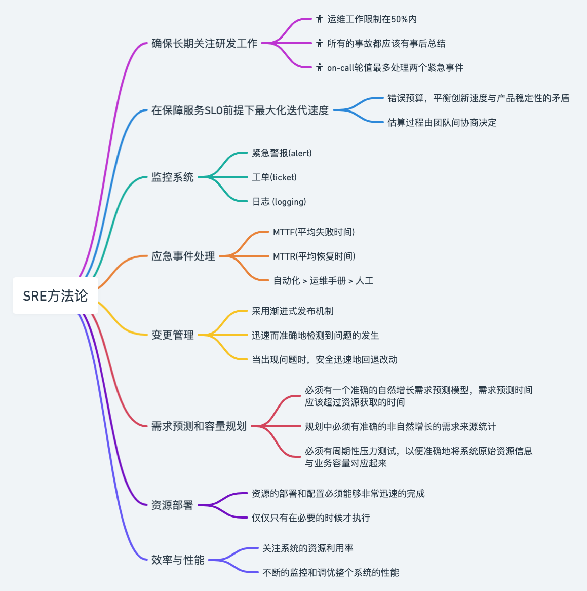
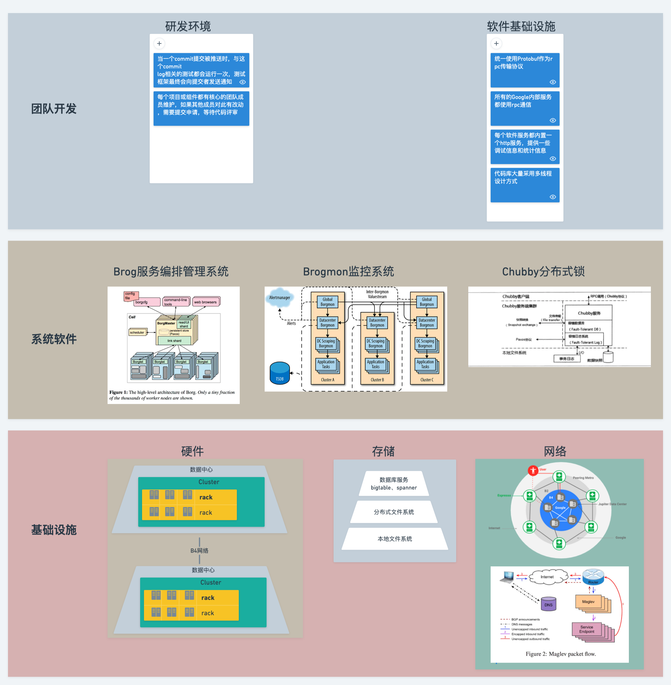
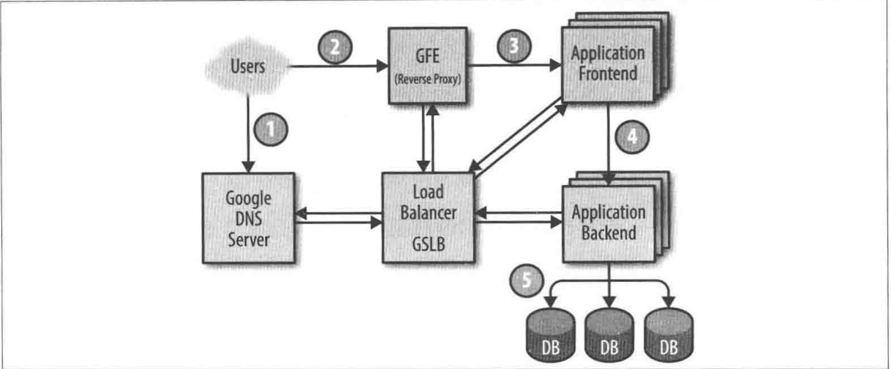

# SRE运维解密

## 概览

> **SRE(soft reliability engineer)**:  软件可靠性保障工程师，特点是用软件工程思维和方法论来完成以前由系统管理员手动完成的任务，倾向于通过设计、构建自动化工具来取代人工操作.
>

## SRE方法论

## 从SRE视角看Google生产环境

google生产环境说明
  
---
硬件

- 物理服务器 (物理机或VM虚拟机)
- 软件服务器 (对外提供服务的软件系统)
- google数据中心的拓扑结构
  - 大约10台服务器组成一个机柜 (Rack)
  - 数台机柜(rack)组成一个机柜排 (Row)
  - 一排或多排机柜组成了一个集群 (Cluster)
  - 一个数据中心 (Datacenter) 包含多个集群
  - 多个相邻的数据中心组成一个园区
  - google数据中心的网络通信
    - 数据中心内物理服务器之间的通信使用交换机以Clos连接方式创建了一个虚拟网络交换机 (Jupiter)
    - 数据中心之间的通信由一套全球覆盖的骨干网B4连接起来的，B4是基于SDN网络技术构建的
    - 参考链接: <https://feisky.gitbooks.io/sdn/content/practice/google.html>

---
存储

- 本地存储： 用于存储临时文件
- 存储系统： 用于永久性存储文件
  - 第一层: 本地文件系统(可以同时使用磁盘和SSD)
  - 第二层: 分布式文件系统Colossus (提供传统文件系统的操作接口、支持复制与加密)
  - 第三层: 数据库服务
    - Bigtable: 一个NoSql数据库，是一个松散存储的、分布式的、有顺序的、持久化的多维映射表，支持最终一致的跨数据中心复制模型
    - Spanner:  提供SQL接口以及满足一致性要求的全球数据库

---  
网络

使用了一个基于OpenFlow协议的软件定义网络,采用的是普通的非智能交换组件结合集中化的控制器连接方式,该控制器负责计算网络中的最佳路径。可以将整个集群的复杂路由计算从具体交换硬件上分离开来。

- 带宽控制器BwE: 负责管理所有可用带宽，可以解决分布式路由下难以解决的流量迁移问题
- 全球负载均衡系统GSLB:  为了降低分布式集群的服务延迟，需要能够给用户指派距离最近的、有空余容量的数据中心处理
  - 利用地理位置信息进行负载均衡DNS请求
  - 在用户服务层面进行负载均衡
  - 在远程调用层面进行负载均衡

---
管理物理服务器的系统管理软件Brog

- 要点: 将物理服务器和软件服务器分离开来
- 任务(Job): 可以是软件服务器、批量任务等等
- 任务实例(Task):  每个任务可以由一个或多个任务实例组成
- 任务实例与机器没有一对一的固定关系，所以任务实例不能简单地用IP地址和端口来表示，解决办法
  - 新增一个名称解析系统(BNS), 当启动任务的时候，给具体的任务实例分配一个名字和一个编号
  - 其他任务实例要连某个任务实例时，需要通过BNS来建立连接，BNS负责将这个名称转换成具体的IP地址和端口
- 任务的资源分配
  - 任务需要再配置文件中声明需要的具体资源(比如3CPU、2GB内存). 有了这些信息，任务实例就可以合理分配在不同的物理服务器上
  - Brog会关注物理服务器的故障域属性，比如不会将任务的全部实例都运行在某一个机柜上, 避免出现整个任务的单点故障

---
其他系统软件

- 分布式锁服务Chubby
  - 提供一个与文件系统类似的API用来操作锁，可以处理异地、跨机房级别的锁请求。使用Paxos协议来提供分布式一致性
  - 可以实现主实例选举的关键组件。
  - 适合存放那种对一致性要求非常高的数据
- 监控与警报系统Borgmon
  - 定期从监控对象抓取监控指标(metric), 这些监控指标可以被用来触发警报，也可以存储起来公以后观看。
  - 主要有以下几种方式使用监控系统
    - 对真实问题进行报警
    - 对比服务更新前后的状态变化: 新的版本是否让软件服务器运行得更快了
    - 检查资源使用量随时间的变化情况，这对合理制定资源计划很有用

---
软件基础设施

- 代码库大量采用多线程设计方式，一个任务实例可以同时利用很多个CPU
- 每个软件服务器都有一个内置的HTTP服务，提供一些调试信息和统计信息，供在线调试、监控等使用
- 所有的Google服务之前都是用rpc通信，称为Stubby, 另外一个开源实现就是grpc
- protocol buffer是Google rpc的传输格式

---
研发环境

- 如果一个工程师遇到他工作的项目之外的一个基础组件问题，他可以直接修改这个问题，然后向管理者提交一份改动申请，等待代码评审，最后直接提交。
- 任何对自己项目代码的改动也需要代码评审。
- 当一个commit log被提交时，这个commit直接或间接的测试都会运行一次，然后测试框架最终会向提交者发送通知。

---
示范莎士比亚搜索服务

- 服务的组织方式
  - 批处理部分:  给全部莎士比亚文献创建索引，同时将索引写入一个Bigtable中。
    - 批处理可以用MapReduce框架完成，分别对应三个阶段
    - Mapping阶段：遍历所有文字，分成具体单词，该任务可以利用多实例并行加速.
    - Shuffle阶段: 该程序将上一阶段产生的所有单词和位置进行排序.
    - Reduce阶段: 将上一阶段产生的单词或位置等按单词合并，产生一个新的单词或位置列表
  - 应用程序前端服务器(frontend)部分:  用以接受处理用户请求。
    - 首先，用户使用浏览器访问<https://shakepeare.google.com>, 为了获得IP地址，用户设备需要请求DNS服务器，google的DNS服务器会请求GLSB系统，GLSB通过全局流量负载信息，决定使用哪个IP地址来回复用户
    - 浏览器获得IP地址并连接到GFE HTTP服务器，GFE负责总结TCP连接，并反向代理请求到真正的服务器上，同时GFE从配置文件中找到该请求对应的后端服务。
    - GFE找到后端服务后，会再次咨询GSLB系统，获得一个GSLB分配的、目前可用的Shakespare前端服务器地址，然后发送一个RPC请求
    - Shakepeare前端服务器分析接收到的请求，然后联系GSLB服务，获取可用的Shakespare后端服务器,再构建一个具体查询的Protobuf请求
    - Shakespare后端服务器收到请求后最终请求Bigdtable服务器来获取最终查询结果
    - 结果被写入一个Protobuf结构体中，然后返回给Shakespare前端服务器，再构造HTML最终返回给用户
- 任务和数据的组织方式
  - 如果服务器可以没每秒处理大概100QPS, 通过用户调查显示，峰值流量会达到3470QPS，为了处理这些流量，至少需要35个任务实例，最终决定是至少采用37个实例，也就是N+2模式，考量如下:
    - 在更新过程中，有一个任务实例将会短暂不可用，只有36个实例可提供服务
    - 如果另外一个物理服务器同时也出现问题，那么上面的任务实例也会收到影响，就只剩35个实例可以对外服务，刚好可以满足峰值要求
  - 如果峰值流量是来自全球的，为了更好地服务用户，服务需要部署在欧洲、亚洲、美洲、非洲，每个洲的任务实例根据访问量来决定分配多少个实例，比如美洲部署4个，冗余度降低为N+1(牺牲一些用户体验来降低成本)
  - Bigtable的数据存储
    - 每个地理区域都存放Bigtable副本
    - 利用Bigtable的复制功能，可以同时达到两个目的
      - 当Bigtable服务出现问题时，可以利用副本提供服务
      - 任务实例可以利用本地Bigtable加速数据访问
    - Bigtable仅仅提供最终一致性保障，但是由于数据更新并不频繁，所以问题相对不大

## 指导思想

## 具体实践

## 管理
